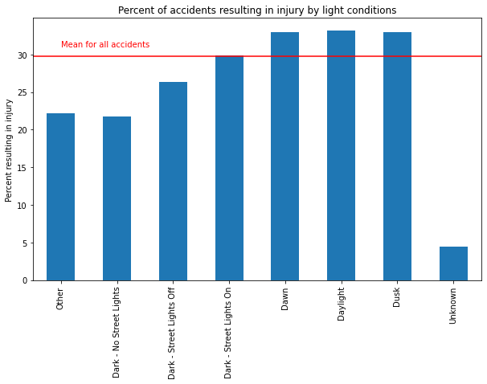
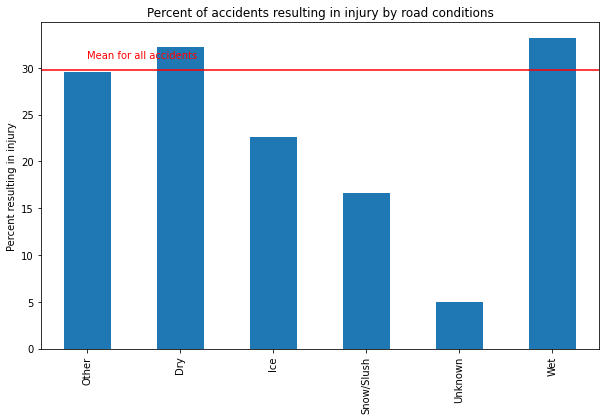
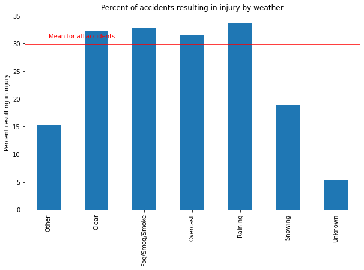

## Introduction/Business Problem
Car accidents are among leading causes of death and injury in the industrialized world. In 2010 there were over 5.4 million car accidents in the United States, in which nearly 33,000 people died, and the numbers have risen since. It is important to state and local governments to understand the factors that lead to dangerous accidents in order to plan traffic systems to minimize the risk of accidents and allocate first responders to minimize the damage from accidents that do happen. We can use historical data on traffic accidents to create a model that predicts which conditions are the most dangerous, which we can then use to put the proper plans in place.

## Data
In this project we will use the provided dataset, which contains traffic accident statistics from the city of Seattle between January 2004 and May 2020. Potentially significant information includes the weather and lighting conditions at the time of the accident, the time of day and exact location, the nature of the collision (e.g. head-on, side-swipe from left, etc.). The incidents are also marked by whether they involved injury or only property damage (the design of the data provides for more detail, such as whether there was serious injury, death or no damage at all, but the provided dataset only contains records marked as “injury” or “only property damage”). We may be able to develop a model that allows us to predict, given environmental conditions, the nature of the accident, and certain other factors, whether an accident is likely to involve personal injury. 

## Methodology 
section which represents the main component of the report where you discuss and describe any exploratory data analysis that you did, any inferential statistical testing that you performed, if any, and what machine learning were used and why.

#### Preprocessing
Some of the data is not presented in a very useful format for analysis. For instance, the dates and times of accidents are given as text, and it will be more useful for our analysis to convert this to categorical data. We started by writing a function that converts the text from the dataset into two columns: "Day of Week" and "Hour of Day". 

Then, for the categorical data that we had just created as well as for other potentially useful columns, we created dummy columns, one for each category of each column, which contained a one if the column contained that category and a zero otherwise. This is a standard method for making categorical data usable in a numerical learning algorithm.

#### Exploring the data
We created a series of bar charts to compare the relative danger of certain conditions. For instance, for the data on road condition, we plotted the percentage of accidents that resulted in injury under each condition. This allowed us to quickly compare the relative likelihood that an accident was injurious across different situations. 

#### Creating a model
Because our data classifies accidents as "resulted in injury" and "did not result in injury", it is binary as opposed to continuous, and we need a model that is appropriate for binary classification. We used two models and compared the results. The first was a simple logistic regression and the second was a neural network with two hidden layers. In both cases, we used the following data as inputs to the model:

* Collision type: A categorical variable describing the way the vehicles collided (e.g. head-on, sideswipe).
* Road condition: A categorical variable describing the road conditions (e.g. dry, muddy) 
* Light condition: A categorical variable describing the light conditions (e.g. daylight, dark with streetlights) 
* Weather: A categorical variable describing the weather (e.g. dry, rain, snow)
* Speeding: A binary variable describing whether speed was a factor
* Under the Influence: A binary vehicle describing whether alcohol was a factor
* Hour of day: A categorical variable describing the hour of the day the accident happened 
* Day of week: A categorical variable describing the day of the week the accident happened. 
* Person count: An integer variable describing the number of people involved
* Pedestrian count: An integer variable describing the number of pedestrians involved
* Vehicle count: An integer variable describing the number of vehicles involved

We split the data into train and test sets. The models were trained on the test data and tested against the test data.

## Results 

### Injury rate by conditions

Shown above are some of the plots we created. It can be seen that accidents in snowy and icy conditions were less likely than average to result in injury. The same is true for accidents in places that were dark with no streetlights. This is perhaps counterintuitive, considering that these conditions make driving more difficult. 

### Models
Our logistic regression predicted correctly whether an accident resulted in injury just over 75% of the time, and our neural network predicted correctly just under 75% of the time. For reasons that will be discussed below, these results are not very satisfying. 

## Discussion 

#### Injury rate by conditions
As stated above, it is at first glance surprising that accidents were less likely in conditions usually considered dangerous. A likely explanation is that these conditions aren't actually safer, but that they cause a noticeable number of extra minor accidents that would under other conditions not have happened at all. To really explore this would involve further research, and probably additional data regarding the total amount of traffic in the road under various conditions. 

#### Models
Because roughly 70% of the accidents in out dataset did not result in injury, a model could guess right 70% of the time simply by classifying every accident as non-injurious. In light of this, the roughly 75% accuracy rate achieved by our models is not very satisfying. We calculated the precision, recall, and F-score of the models, which confirmed that they were not preforming well enough to be useful. The logistic regression achieved an F-score of 0.41, and the neural network an F-score of 0.48. It may be that whether a collision results in injury involves either too much randomness, or  depends on factors that were not present in our dataset.

# Conclusion 
We can use data science tools to learn some interesting things about how different factors affect the chance that a traffic collision results in injury. One way to go about this is to use the data to create visualizations that allow the reader to get an idea of the meaning of the data. Another possibility is to use machine learning to build a tool that will make predictions based on new data. In our case, the data we used turned out to be insufficient to make good predictions, but it could be a first step towards a better model.